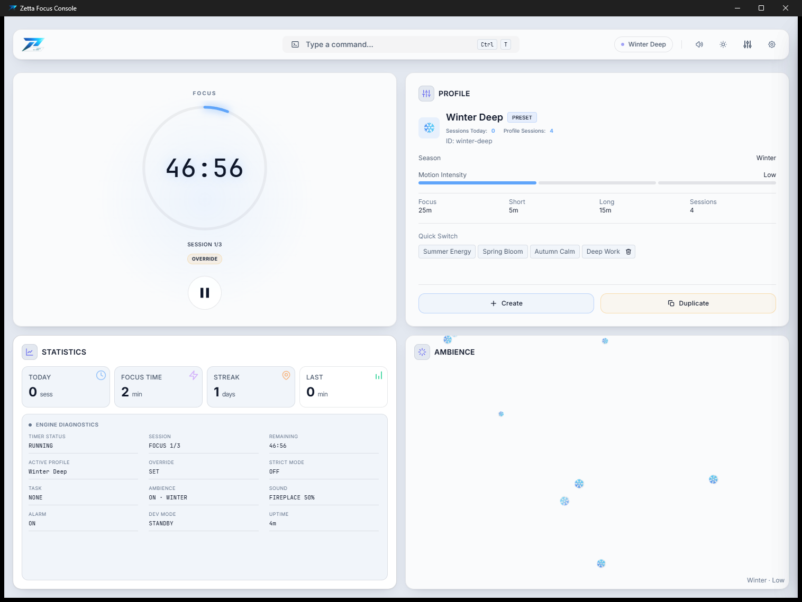
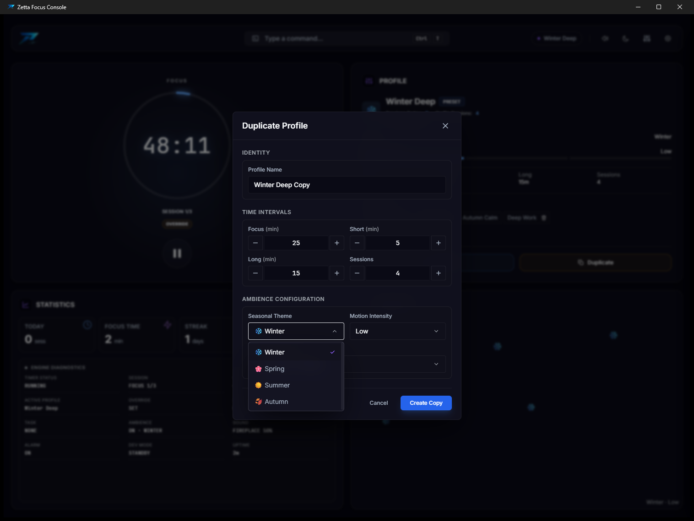
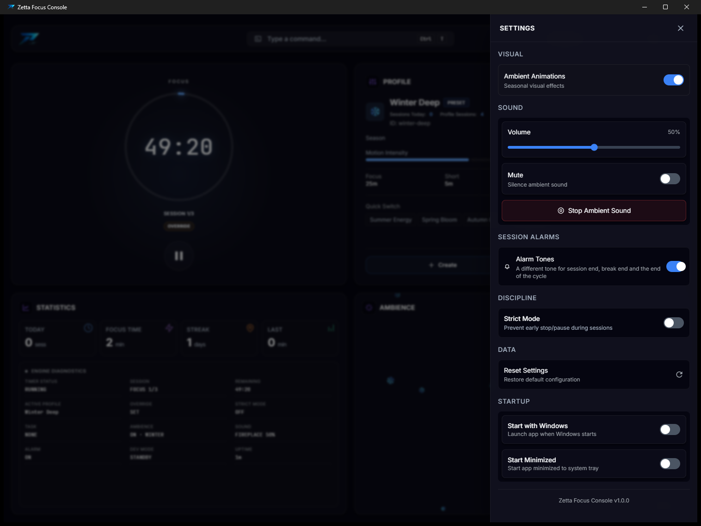
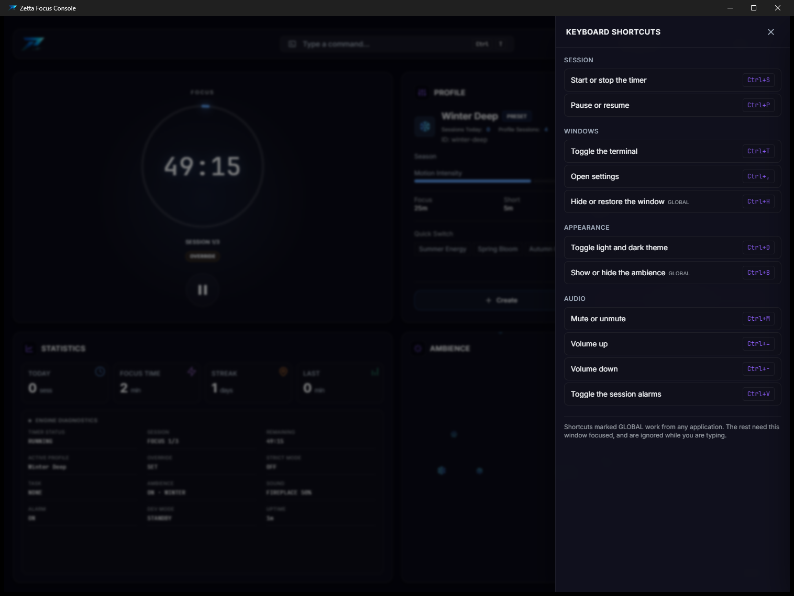

# Zetta Focus Console

**A focus timer you drive from a terminal.** Type `timer 50m break 10m loop 3`,
press enter, and get back to work.


It is a Pomodoro timer, but the interface is a command line rather than a
settings screen, the timer state lives in Rust rather than in the browser, and
the window behind it drifts with the season — snow in winter, blossom in
spring, falling leaves in autumn — with an ambient loop underneath it.

Free, MIT, no account, no telemetry, nothing leaves your machine. A 4.9 MB
installer.

---

## Why a terminal

Every timer app puts duration behind a settings panel: open it, find the field,
clear it, type, close it. That is four interactions to change one number, and
you do it constantly, because *25/5* is a default, not a fit — some work wants
fifty minutes and some wants fifteen.

A command line is one interaction:

```
$ timer 50m break 10m loop 3
Override set:
  - Focus: 50m
  - Break: 10m
  - Sessions: 3

Run `start` to begin session.
$ s
Starting session... [Override: 50m focus, 10m break, 3 sessions]
```


`s` starts. `p` pauses. `r` stops. The full command set is below, but those
three and `timer` cover most days.

---

## Install

Grab an installer from [**releases**](../../releases), or build it yourself.

### Build it yourself

Needs [Rust](https://rustup.rs), Node 20+, and [Bun](https://bun.sh). On Linux you will also
need the Tauri system dependencies — webkit2gtk, and `libasound2-dev` for
audio.

```bash
bun install
bun run tauri build      # installers land in src-tauri/target/release/bundle
bun run tauri dev        # or run it in development
```

---

## What it does

Three things it does that other timers do not:

**The command line is the interface.** Durations, profiles, sound, strict mode
and the engine's own state are all reachable by typing, with aliases for the
handful you use constantly and a history that survives a restart. There is no
settings screen you have to go and find.

**Rust owns the clock.** The timer is a state machine in Rust and the interface
renders what it reports — it keeps no clock of its own, so there is nothing to
drift out of step. The tray icon comes from the same state: a ring around the
app mark that fills as the session runs, coloured for focus, break, strict mode
or idle.

**The window keeps you company.** The active profile's own icon drifts through
the ambience panel — snow falls in winter, blossom in spring, leaves in autumn,
sun rises off summer — over one of four seamless ambient loops. It is ordinary
DOM and CSS: no video, no sprite sheets, no WebGL.

And the rest:

- **A week you can see.** The statistics panel keeps a row per day and draws
  the last seven as bars, scaled against your own best day rather than a target
  the app invented. Ninety days are kept; nothing leaves the machine.
- **Profiles.** Four presets, plus as many of your own as you want — duration,
  season, motion, sound and volume per profile.
- **Strict Mode.** Start a session that cannot be paused or stopped.
  Force-closing the app marks it failed.
- **Alarms.** Three synthesised tones — session end, break end, cycle end.
  Generated in the app, so nothing is downloaded and they sound the same
  everywhere.
- **Ambient sound.** Fireplace, soft rain, light wind, rain on a window.
  Seamless 45-second Vorbis loops, embedded in the binary.
- **Tray and global keys.** Runs from the tray, and `Ctrl+H` hides and restores
  the window from any application.

### Both themes, and the same app in each

`Ctrl+D` switches. The ambience draws in either one — the light theme is not a
stripped-down version of the dark one.

<table>
<tr>
<td width="50%">

</td>
<td width="50%">

</td>
</tr>
<tr>
<td width="50%">

</td>
<td width="50%">

</td>
</tr>
</table>

Every screenshot has a twin in the other theme in
[`docs/screenshots/`](docs/screenshots), which also says what each one is
supposed to show.

---

## Commands

Type `help` in the terminal to open this list in the app, over the console
rather than instead of it.

### Session

```
start                   Start a session (uses the override if set)
stop                    Stop the current session
pause                   Pause
resume                  Resume
status                  Current session state
sessions [1-20]         Sessions per cycle
```

Aliases: `s` and `st` for `start`, `p` for `pause`, `r` for `stop`.

### Durations

```
timer 50m               Override focus duration
break 10m               Override break duration
loop 3                  Override session count
override clear          Drop the override, return to profile defaults
```

The three compose into one line in any order, which is the whole argument for
typing at it: `timer 50m break 10m loop 3`, or `break 10m loop 3` to leave the
focus duration alone.

Durations accept `25m`, `90s`, or a bare number read as minutes. You can also
click the clock itself while it is idle and type into it.

A duration on its own is a one-off — one run, no break after it, no session
counter, and the override retires when it finishes. Add `loop 3` and you are
asking for a cycle instead, which you get: three focus runs with breaks between
them.

### Profiles

```
profile list            Show all profiles
profile switch [id]     Switch
profile create <name> <focus> <short> <long> <sessions> <season> <intensity> <sound>
profile edit [id]       Edit a custom profile
profile duplicate       Copy a profile
profile delete [id]     Delete a custom profile
```

Presets are read-only — duplicate one to base your own on it.

### Appearance and sound

```
season [name]           spring | summer | autumn | winter
theme [mode]            dark | light | system
ambience on/off         Show or hide the drifting particles
sound play | stop       Ambient audio
sound volume [0-100]
sound mute
alarm on/off            Tones at session, break and cycle end
```

### Discipline

```
strict on               No pausing, no stopping, until the session completes
strict off              Only while idle
task set "name" --category coding
```

### Diagnostics

```
stats                   Statistics, and how the last seven days went
reset                   Restore defaults and clear the statistics
system                  Host CPU and memory
memory | cpu            Narrower views of the same
usage                   Engine process memory and uptime
engine state            Full engine state dump
engine reset            Reset the engine
devmode on/off          Developer diagnostics
```

### The console itself

```
history                 The commands you have run
history clear           Forget them
clear                   Clear the terminal
help                    Open the command list, on top of the console
```

Tab completes, `↑` and `↓` walk the history, and the history is kept next to
your preferences on disk rather than in the window — so it is still there after
a restart.

---

## Shortcuts

The same list is in the app, under the keyboard icon in the header. The two
marked **global** work from any application; the rest need the window focused.

| Key | Action |
|---|---|
| `Ctrl+S` | Start or stop the timer |
| `Ctrl+P` | Pause or resume |
| `Ctrl+T` | Toggle the terminal |
| `Ctrl+,` | Open settings |
| `Ctrl+H` | Hide or restore the window — **global** |
| `Ctrl+D` | Toggle light and dark theme |
| `Ctrl+B` | Show or hide the ambience — **global** |
| `Ctrl+M` | Mute or unmute |
| `Ctrl+=` / `Ctrl+-` | Volume up and down |
| `Ctrl+V` | Toggle the session alarms |

The tray menu carries start, stop, pause, resume, settings and quit, and the
tray icon shows the session: a ring around the app mark that fills as the run
goes on, violet for focus, green for a break, amber in Strict Mode, and a plain
grey outline when nothing is running.

---

## Where your data lives

One file, on your machine:

```
Windows   %APPDATA%\ZettaFocus\preferences.json
macOS     ~/Library/Application Support/ZettaFocus/preferences.json
Linux     ~/.local/share/ZettaFocus/preferences.json
```

It holds your profiles, theme, volume, statistics, preferences and the console's
command history. There is no account, no sync, no analytics, and no network
call — the app does not open a socket. To reset it completely, delete that file.

---

## How it is built

Tauri 2, React 19 and TypeScript on the front, Rust behind it.

The split is deliberate: **Rust is the authority on state.** `AppState` holds
the timer, the active profile, sound and strict mode, and every command — typed
into the terminal or clicked in the UI — goes through `execute_command` and
comes back as a state event the UI renders. The React side owns no timer state
of its own, so there is nothing to drift.

```
src-tauri/src/
  engine.rs      EngineState: app state, sound, system probe
  state.rs       AppState, preference load/save
  commands/      timer.rs (the engine + command processing), profile.rs, parser.rs
  sound.rs       Vorbis playback via rodio
  storage.rs     preferences.json
  tray.rs        the tray icon, drawn from the same state
src/
  components/    UI, including the ambience in ambient-panel/
  hooks/app/     the bridge to Rust — one state subscription, no local clock
```

Some notes on choices that are not obvious:

- **Vorbis, not MP3.** Every ambient track loops forever. MP3 carries encoder
  delay and padding that decode as silence at both ends, so each pass through
  the loop clicks. Vorbis is gapless.
- **45-second loops.** The source recordings ran up to ten and a half minutes at
  256 kbps. Since they loop, everything past the loop point is inaudible — and
  those four files were 42 MB of a 44 MB bundle. See [ASSETS.md](ASSETS.md).
- **One persistent `System` probe.** `sysinfo`'s `System::new_all()` snapshots
  every process, disk and network on the machine. Building one every five
  seconds to read two numbers is both wasteful and wrong — CPU usage is a delta
  between refreshes, so a fresh `System` always reports zero.
- **The ambience is text.** Each particle is the profile’s emoji in a `div`,
  moved by a CSS transform. A glyph is rasterised into a shared cache once and
  reused by every particle, where an SVG is a path subtree each and a blurred
  gradient is a texture — so the cheapest thing to draw is also the one that
  ties the panel to the profile.
- **The tray icon is drawn, not shipped.** Four PNGs would be four more files to
  keep in step with the app mark, and the progress arc would need a file per
  position. It is rasterised from the bundled icon at 32×32, quantised to
  twenty-four arc positions, and only handed to the OS when it would actually
  change — so a fifty-minute session repaints the tray two dozen times rather
  than three thousand.

---

## History

This repository begins at a single commit. That is deliberate, and I would
rather explain it than leave it as a puzzle.

I built the app through the first half of 2026 as a private project, over about
eighty commits, and squashed that history when I opened the repository up. Two
reasons. It carried 42 MB of the original uncompressed audio in its objects, so
every clone would have paid for that forever to fetch files the app no longer
uses. And it carried a pile of planning documents describing a paid version of
this product that no longer exists, which would have been actively misleading to
read.

I am not withholding any of the code. What is here is the whole application, and
[CHANGELOG.md](CHANGELOG.md) tracks it from this point on.

## What is next

See [ROADMAP.md](ROADMAP.md) — what is coming, and an explicit list of what is
not, so nobody spends a weekend on a pull request that gets declined.

## Licence

MIT — see [LICENSE](LICENSE).

The code is MIT. The ambient audio is third-party work under its own terms,
documented in [ASSETS.md](ASSETS.md).
